# 4+1 Architectural View Model
## Library Management System - Complete Diagrams

**System:** Library Management System (PSOFT-G1)  
**Date:** October 27, 2025  
**Architecture Model:** 4+1 View (Philippe Kruchten)

---

## Table of Contents

1. [Logical View](#1-logical-view)
   - [Level 1: System Context](#level-1-system-context)
   - [Level 2: Module Structure](#level-2-module-structure)
   - [Level 3: Class Relationships](#level-3-class-relationships)
2. [Process View](#2-process-view)
   - [Level 1: System Processes](#level-1-system-processes)
   - [Level 2: Component Interactions](#level-2-component-interactions)
   - [Level 3: Detailed Sequence Flows](#level-3-detailed-sequence-flows)
3. [Development View](#3-development-view)
   - [Level 1: Layer Architecture](#level-1-layer-architecture)
   - [Level 2: Package Organization](#level-2-package-organization)
   - [Level 3: Module Dependencies](#level-3-module-dependencies)
4. [Physical View](#4-physical-view)
   - [Level 1: Deployment Overview](#level-1-deployment-overview)
   - [Level 2: Infrastructure Components](#level-2-infrastructure-components)
   - [Level 3: Detailed Deployment](#level-3-detailed-deployment)
5. [Scenarios/Use Cases](#5-scenarios-use-cases)
   - [Level 1: Key Use Cases](#level-1-key-use-cases)
   - [Level 2: Detailed Use Case Flows](#level-2-detailed-use-case-flows)
   - [Level 3: End-to-End Scenarios](#level-3-end-to-end-scenarios)

---

## 1. Logical View

The Logical View describes the system's functionality from the end-user perspective, showing key abstractions and their relationships.

### Level 1: System Context

**High-level system context showing main functional areas and external actors.**

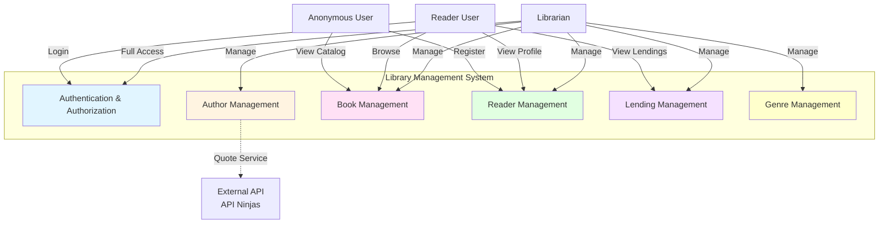

### Level 2: Module Structure

**Detailed view of core modules showing their internal components and relationships.**

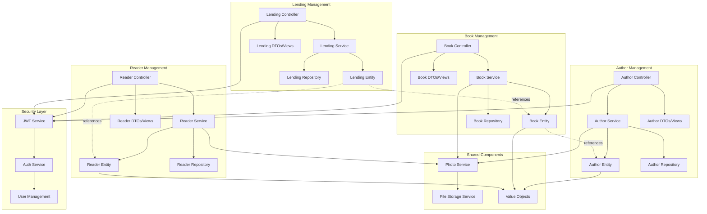

### Level 3: Class Relationships

**Detailed class diagram showing domain entities, value objects, and key relationships.**

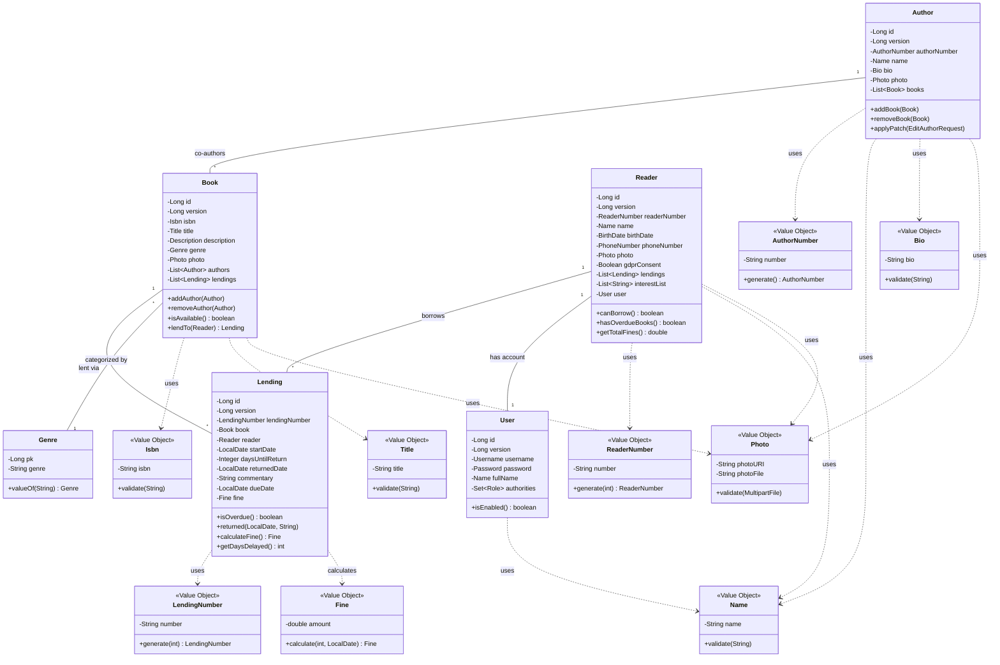

---

## 2. Process View

The Process View describes the runtime behavior, concurrency, and communication aspects of the system.

### Level 1: System Processes

**High-level process view showing main runtime components and their interactions.**

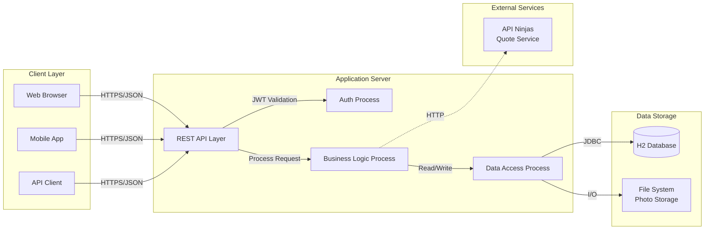

### Level 2: Component Interactions

**Detailed process interactions showing concurrent operations and message flows.**

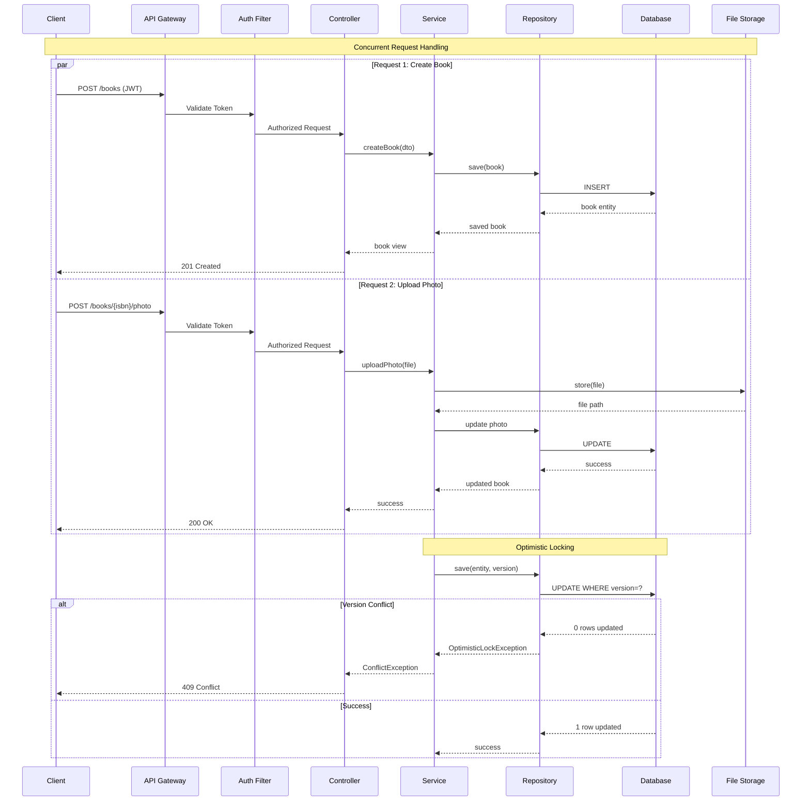

### Level 3: Detailed Sequence Flows

**Detailed sequence diagrams for critical business processes.**

#### 3.1 Book Lending Process with Concurrency Control

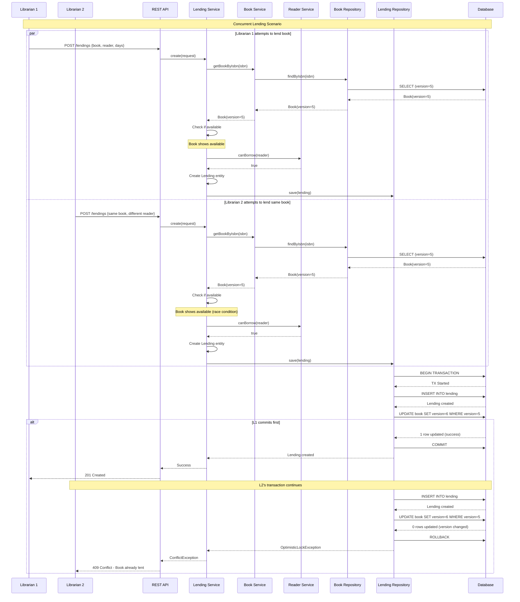

#### 3.2 Fine Calculation and Book Return Process

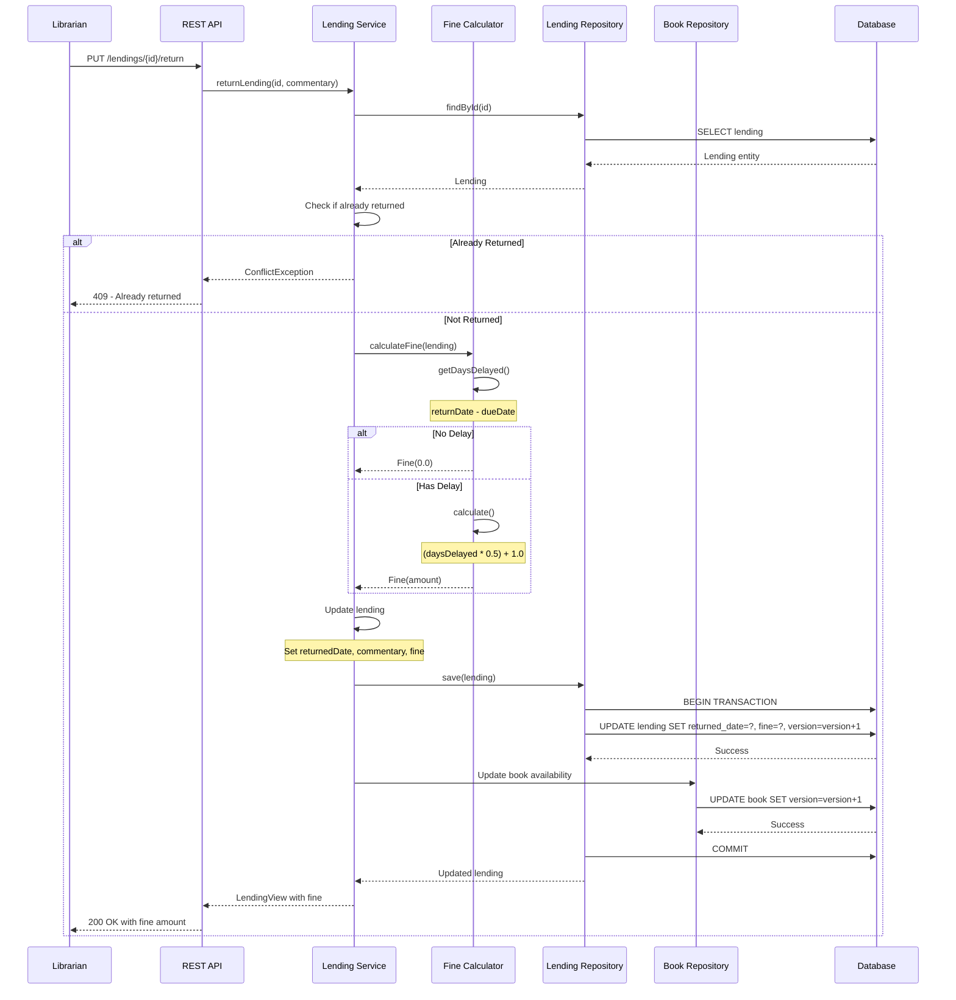

#### 3.3 Authentication and Authorization Flow

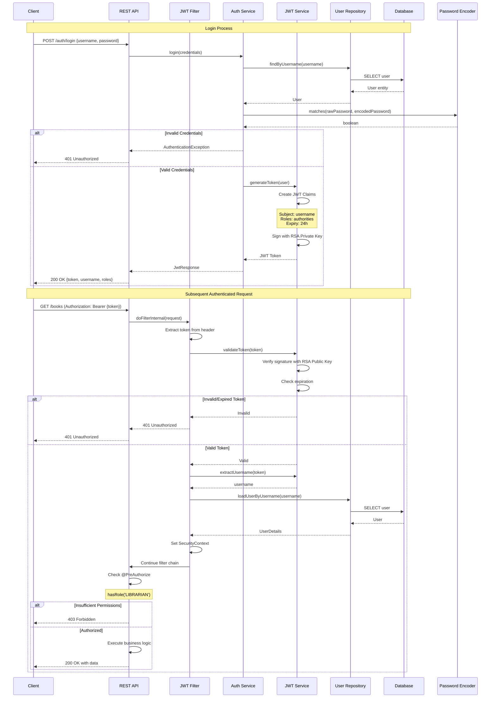

---

## 3. Development View

The Development View shows the software module organization, package structure, and dependencies from a programmer's perspective.

### Level 1: Layer Architecture

**High-level layered architecture showing separation of concerns.**

```mermaid
graph TB
    subgraph "Presentation Layer"
        REST[REST Controllers]
        DTOs[DTOs & Views]
        MAPPERS[MapStruct Mappers]
        VALIDATORS[Request Validators]
    end
    
    subgraph "Application Layer"
        SERVICES[Service Interfaces]
        SERVICE_IMPL[Service Implementations]
        FACADES[Service Facades]
    end
    
    subgraph "Domain Layer"
        ENTITIES[Domain Entities]
        VALUE_OBJ[Value Objects]
        DOMAIN_RULES[Business Rules]
        DOMAIN_EVENTS[Domain Events]
    end
    
    subgraph "Infrastructure Layer"
        REPOS[Repository Interfaces]
        REPO_IMPL[JPA Implementations]
        FILE_STORAGE[File Storage]
        EXTERNAL[External API Clients]
    end
    
    subgraph "Cross-Cutting Concerns"
        SECURITY[Security Config]
        EXCEPTIONS[Exception Handlers]
        CONFIG[Application Config]
        BOOTSTRAP[Data Bootstrapping]
    end
    
    REST --> SERVICES
    DTOs -.-> ENTITIES
    MAPPERS -.-> DTOs
    MAPPERS -.-> ENTITIES
    
    SERVICES --> ENTITIES
    SERVICE_IMPL --> ENTITIES
    SERVICE_IMPL --> VALUE_OBJ
    SERVICE_IMPL --> REPOS
    
    ENTITIES --> VALUE_OBJ
    ENTITIES --> DOMAIN_RULES
    
    REPOS --> ENTITIES
    REPO_IMPL -.-> REPOS
    
    SERVICE_IMPL --> FILE_STORAGE
    SERVICE_IMPL --> EXTERNAL
    
    REST --> SECURITY
    SERVICES --> EXCEPTIONS
    
    style "Presentation Layer" fill:#e3f2fd
    style "Application Layer" fill:#fff3e0
    style "Domain Layer" fill:#f3e5f5
    style "Infrastructure Layer" fill:#e8f5e9
    style "Cross-Cutting Concerns" fill:#fce4ec
```

### Level 2: Package Organization

**Detailed package structure showing modular organization by business capability.**

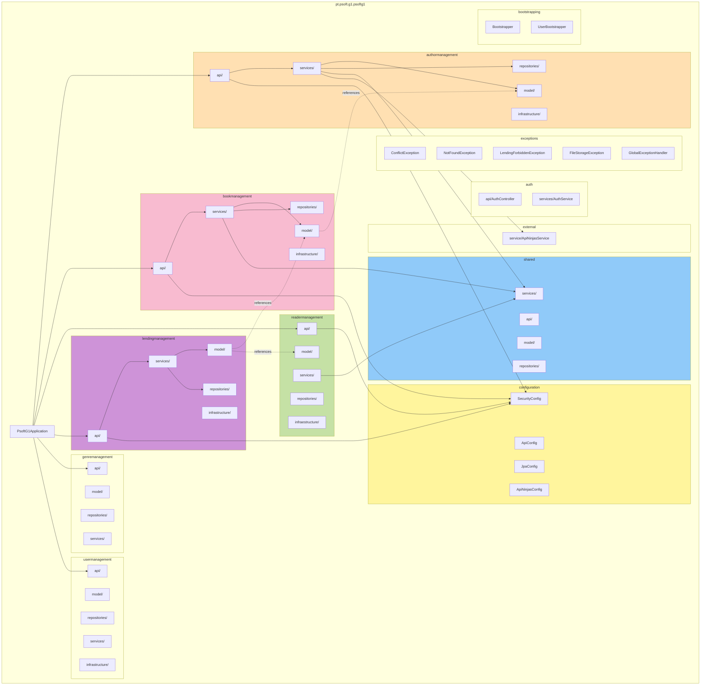

### Level 3: Module Dependencies

**Detailed dependency diagram showing inter-module relationships and shared components.**

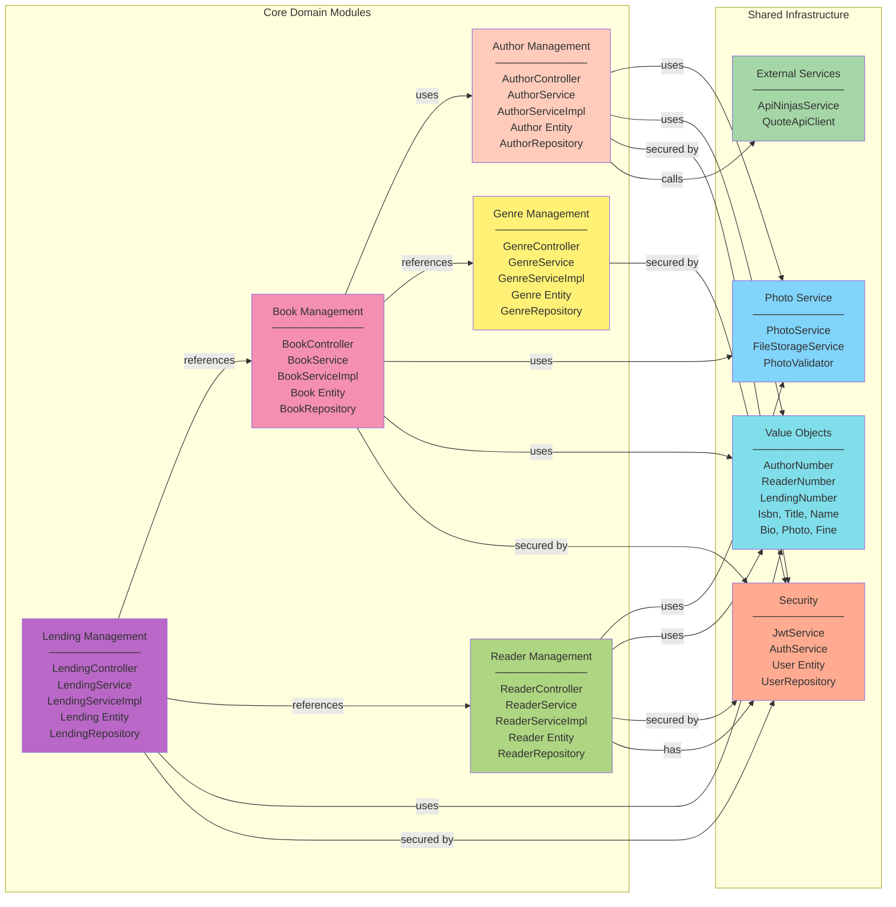

---

## 4. Physical View

The Physical View describes the deployment of software components on hardware infrastructure.

### Level 1: Deployment Overview

**High-level deployment architecture showing system topology.**

```mermaid
graph TB
    subgraph "Client Tier"
        WEB_BROWSER[Web Browser]
        MOBILE_APP[Mobile App]
        POSTMAN[API Testing Tools]
    end
    
    subgraph "Application Tier"
        direction TB
        APP_SERVER[Spring Boot<br/>Embedded Tomcat<br/>Port: 8080]
    end
    
    subgraph "Data Tier"
        direction TB
        H2_DB[(H2 Database<br/>File: ./data/psoft-g1.mv.db<br/>Console: 8080/h2-console)]
        FILE_SYS[File System Storage<br/>./photos/]
    end
    
    subgraph "External Services"
        API_NINJAS[API Ninjas<br/>Quote Service<br/>api-ninjas.com]
    end
    
    WEB_BROWSER -->|HTTPS:8080| APP_SERVER
    MOBILE_APP -->|HTTPS:8080| APP_SERVER
    POSTMAN -->|HTTP/HTTPS:8080| APP_SERVER
    
    APP_SERVER -->|JDBC| H2_DB
    APP_SERVER -->|File I/O| FILE_SYS
    APP_SERVER -.->|REST API| API_NINJAS
    
    style "Client Tier" fill:#e3f2fd
    style "Application Tier" fill:#fff3e0
    style "Data Tier" fill:#e8f5e9
    style "External Services" fill:#fce4ec
```

### Level 2: Infrastructure Components

**Detailed infrastructure view showing runtime components and configurations.**

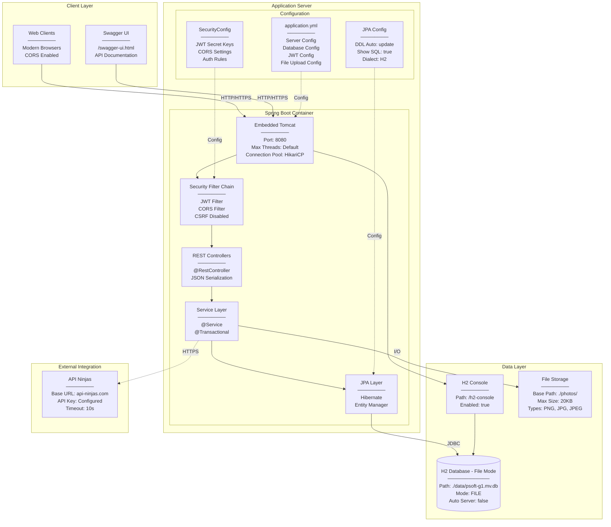

### Level 3: Detailed Deployment

**Comprehensive deployment diagram with all configuration details.**

```mermaid
graph TB
    subgraph "Development Environment"
        DEV_MACHINE[Developer Machine<br/>────────<br/>OS: Windows/Mac/Linux<br/>Java: 17<br/>Maven: 3.x<br/>IDE: IntelliJ/Eclipse]
    end
    
    subgraph "Application Runtime"
        direction TB
        
        subgraph "JVM Process"
            JVM[Java Virtual Machine<br/>────────<br/>Java 17<br/>Heap: -Xmx (default)<br/>Metaspace: -XX:MaxMetaspaceSize]
            
            subgraph "Spring Boot Application"
                MAIN[PsoftG1Application<br/>────────<br/>@SpringBootApplication<br/>Main Method]
                
                CONTEXT[Application Context<br/>────────<br/>Bean Factory<br/>Dependency Injection<br/>Component Scanning]
                
                TOMCAT_EMBED[Embedded Tomcat 10.x<br/>────────<br/>Port: 8080<br/>Protocol: HTTP/1.1<br/>Compression: Enabled<br/>Max Request Size: 200MB]
                
                subgraph "Web Layer"
                    DISPATCHER[Dispatcher Servlet<br/>────────<br/>URL Mapping<br/>Request Routing]
                    
                    FILTER_CHAIN[Filter Chain<br/>────────<br/>1. CORS Filter<br/>2. JWT Authentication Filter<br/>3. Authorization Filter<br/>4. Exception Handler]
                end
                
                subgraph "Security Layer"
                    SEC_CONTEXT[Security Context<br/>────────<br/>Authentication Object<br/>Granted Authorities<br/>Thread-bound]
                    
                    JWT_UTIL[JWT Utility<br/>────────<br/>RSA Key Pair<br/>Private: jwt/private_key.pem<br/>Public: jwt/public_key.pem<br/>Expiry: 24h]
                    
                    PWD_ENC[BCrypt Encoder<br/>────────<br/>Strength: 10<br/>Salt: Random]
                end
                
                subgraph "Business Layer"
                    CONTROLLERS[REST Controllers<br/>────────<br/>@RestController<br/>@RequestMapping<br/>@PreAuthorize]
                    
                    SERVICES[Service Beans<br/>────────<br/>@Service<br/>@Transactional<br/>Business Logic]
                    
                    MAPPERS[MapStruct Mappers<br/>────────<br/>DTO ↔ Entity<br/>Compile-time Generation]
                end
                
                subgraph "Data Access Layer"
                    REPO_PROXIES[Repository Proxies<br/>────────<br/>JPA Interface Impl<br/>Query Method Generation]
                    
                    ENTITY_MANAGER[Entity Manager<br/>────────<br/>Persistence Context<br/>1st Level Cache<br/>Transaction Management]
                    
                    HIKARI_POOL[HikariCP Connection Pool<br/>────────<br/>Min Connections: 10<br/>Max Connections: 10<br/>Timeout: 30s<br/>Leak Detection: 0]
                end
            end
        end
    end
    
    subgraph "Persistence Layer"
        direction LR
        
        H2_ENGINE[(H2 Database Engine<br/>────────────<br/>Version: 2.x<br/>Mode: FILE/AUTO_SERVER<br/>DB File: ./data/psoft-g1.mv.db<br/>Lock File: .lock.db<br/>Trace File: .trace.db)]
        
        H2_WEB_SERVER[H2 Web Console<br/>────────<br/>Port: 8080<br/>Context: /h2-console<br/>JDBC URL: jdbc:h2:file:./data/psoft-g1<br/>Username: sa<br/>Password: (empty)]
    end
    
    subgraph "File System"
        direction TB
        
        APP_ROOT[Application Root Directory<br/>────────<br/>./<br/>psoft-g1-project/]
        
        DATA_DIR[data/<br/>────────<br/>psoft-g1.mv.db<br/>psoft-g1.trace.db]
        
        PHOTO_DIR[photos/<br/>────────<br/>authors/<br/>books/<br/>readers/]
        
        RESOURCES[src/main/resources/<br/>────────<br/>application.yml<br/>jwt/private_key.pem<br/>jwt/public_key.pem]
        
        LOGS[logs/<br/>────────<br/>application.log<br/>spring.log]
    end
    
    subgraph "External Dependencies"
        API_NINJAS_EXT[API Ninjas Service<br/>────────<br/>URL: https://api.api-ninjas.com/v1/quotes<br/>Method: GET<br/>Auth: X-Api-Key header<br/>Response: JSON<br/>Timeout: 10s<br/>Retry: None]
    end
    
    DEV_MACHINE -->|mvn spring-boot:run| MAIN
    MAIN --> CONTEXT
    CONTEXT --> TOMCAT_EMBED
    
    TOMCAT_EMBED --> DISPATCHER
    DISPATCHER --> FILTER_CHAIN
    FILTER_CHAIN --> SEC_CONTEXT
    SEC_CONTEXT --> JWT_UTIL
    
    FILTER_CHAIN --> CONTROLLERS
    CONTROLLERS --> MAPPERS
    CONTROLLERS --> SERVICES
    SERVICES --> REPO_PROXIES
    
    REPO_PROXIES --> ENTITY_MANAGER
    ENTITY_MANAGER --> HIKARI_POOL
    HIKARI_POOL -->|JDBC Connection| H2_ENGINE
    
    TOMCAT_EMBED --> H2_WEB_SERVER
    H2_WEB_SERVER --> H2_ENGINE
    
    H2_ENGINE -.->|Persist| DATA_DIR
    SERVICES -.->|Read/Write| PHOTO_DIR
    CONTEXT -.->|Load| RESOURCES
    SERVICES -.->|Write| LOGS
    
    SERVICES -.->|HTTP Client| API_NINJAS_EXT
    
    DATA_DIR -.-> APP_ROOT
    PHOTO_DIR -.-> APP_ROOT
    LOGS -.-> APP_ROOT
    
    style "Development Environment" fill:#e1f5fe
    style "Application Runtime" fill:#fff9c4
    style "Persistence Layer" fill:#f1f8e9
    style "File System" fill:#fce4ec
    style "External Dependencies" fill:#ede7f6
```

---

## 5. Scenarios / Use Cases

The Scenarios view (the "+1") ties together all other views through use cases and user stories.

### Level 1: Key Use Cases

**High-level use case diagram showing main system functionalities.**

```mermaid
graph TB
    subgraph "Actors"
        LIBRARIAN((Librarian))
        READER((Reader))
        ANONYMOUS((Anonymous User))
        SYSTEM((System))
    end
    
    subgraph "Library Management System"
        direction TB
        
        subgraph "Authentication"
            UC_LOGIN[Login]
            UC_LOGOUT[Logout]
        end
        
        subgraph "Author Management"
            UC_CREATE_AUTHOR[Create Author]
            UC_UPDATE_AUTHOR[Update Author]
            UC_VIEW_AUTHOR[View Author Details]
            UC_LIST_AUTHORS[List Authors]
            UC_PHOTO_AUTHOR[Manage Author Photo]
        end
        
        subgraph "Book Management"
            UC_CREATE_BOOK[Create Book]
            UC_UPDATE_BOOK[Update Book]
            UC_VIEW_BOOK[View Book Details]
            UC_SEARCH_BOOKS[Search Books]
            UC_PHOTO_BOOK[Manage Book Photo]
        end
        
        subgraph "Reader Management"
            UC_REGISTER[Register Reader]
            UC_UPDATE_READER[Update Reader Profile]
            UC_VIEW_READER[View Reader Details]
            UC_LIST_READERS[List Readers]
            UC_PHOTO_READER[Manage Reader Photo]
        end
        
        subgraph "Lending Operations"
            UC_CREATE_LENDING[Create Lending]
            UC_RETURN_BOOK[Return Book]
            UC_VIEW_LENDING[View Lending Details]
            UC_LIST_LENDINGS[List Lendings]
            UC_CALC_FINE[Calculate Fine]
        end
        
        subgraph "Reporting"
            UC_AVG_LEND[Average Lending Duration]
            UC_READER_LEND[Reader Lending History]
            UC_OVERDUE[Overdue Lendings]
        end
    end
    
    LIBRARIAN -->|performs| UC_LOGIN
    LIBRARIAN -->|performs| UC_CREATE_AUTHOR
    LIBRARIAN -->|performs| UC_UPDATE_AUTHOR
    LIBRARIAN -->|performs| UC_CREATE_BOOK
    LIBRARIAN -->|performs| UC_UPDATE_BOOK
    LIBRARIAN -->|performs| UC_CREATE_LENDING
    LIBRARIAN -->|performs| UC_RETURN_BOOK
    LIBRARIAN -->|performs| UC_UPDATE_READER
    LIBRARIAN -->|performs| UC_LIST_AUTHORS
    LIBRARIAN -->|performs| UC_LIST_READERS
    LIBRARIAN -->|performs| UC_LIST_LENDINGS
    LIBRARIAN -->|views| UC_AVG_LEND
    LIBRARIAN -->|views| UC_OVERDUE
    
    READER -->|performs| UC_LOGIN
    READER -->|performs| UC_VIEW_READER
    READER -->|performs| UC_UPDATE_READER
    READER -->|performs| UC_SEARCH_BOOKS
    READER -->|performs| UC_VIEW_BOOK
    READER -->|performs| UC_VIEW_LENDING
    READER -->|views| UC_READER_LEND
    
    ANONYMOUS -->|performs| UC_REGISTER
    ANONYMOUS -->|performs| UC_SEARCH_BOOKS
    ANONYMOUS -->|performs| UC_VIEW_BOOK
    ANONYMOUS -->|performs| UC_VIEW_AUTHOR
    
    UC_RETURN_BOOK -.->|includes| UC_CALC_FINE
    UC_CREATE_LENDING -.->|requires| UC_VIEW_BOOK
    UC_CREATE_LENDING -.->|requires| UC_VIEW_READER
    
    SYSTEM -->|triggers| UC_CALC_FINE
```

### Level 2: Detailed Use Case Flows

**Detailed sequence diagrams for major use case scenarios.**

#### 2.1 Complete Book Lending Scenario

```mermaid
sequenceDiagram
    actor Librarian
    participant UI as Web Interface
    participant API as REST API
    participant AuthSrv as Auth Service
    participant BookSrv as Book Service
    participant ReaderSrv as Reader Service
    participant LendSrv as Lending Service
    participant DB as Database
    
    Note over Librarian,DB: Scenario: Librarian lends a book to a reader
    
    %% Step 1: Login
    rect rgb(200, 230, 255)
        Note over Librarian,AuthSrv: Phase 1: Authentication
        Librarian->>UI: Enter credentials
        UI->>API: POST /auth/login
        API->>AuthSrv: authenticate(username, password)
        AuthSrv->>DB: Verify credentials
        DB-->>AuthSrv: User details
        AuthSrv-->>API: JWT Token
        API-->>UI: Token + User info
        UI-->>Librarian: Login successful
    end
    
    %% Step 2: Search for book
    rect rgb(255, 230, 230)
        Note over Librarian,BookSrv: Phase 2: Find Book
        Librarian->>UI: Search for book by title
        UI->>API: GET /books?title=...
        Note over API: Include JWT in header
        API->>BookSrv: searchBooks(title)
        BookSrv->>DB: Query books
        DB-->>BookSrv: Book list
        BookSrv-->>API: BookView list
        API-->>UI: JSON response
        UI-->>Librarian: Display books
        
        Librarian->>UI: Select book (check availability)
        UI->>API: GET /books/{isbn}
        API->>BookSrv: getBookByIsbn(isbn)
        BookSrv->>DB: Find book with lendings
        DB-->>BookSrv: Book + current lendings
        BookSrv->>BookSrv: Check if available
        BookSrv-->>API: BookView with availability
        API-->>UI: Book details
        UI-->>Librarian: Show "Available for lending"
    end
    
    %% Step 3: Find reader
    rect rgb(230, 255, 230)
        Note over Librarian,ReaderSrv: Phase 3: Find Reader
        Librarian->>UI: Search for reader by name
        UI->>API: GET /readers?name=...
        API->>ReaderSrv: searchReaders(name)
        ReaderSrv->>DB: Query readers
        DB-->>ReaderSrv: Reader list
        ReaderSrv-->>API: ReaderView list
        API-->>UI: JSON response
        UI-->>Librarian: Display readers
        
        Librarian->>UI: Select reader (check eligibility)
        UI->>API: GET /readers/{readerNumber}
        API->>ReaderSrv: getReaderDetails(readerNumber)
        ReaderSrv->>DB: Find reader with lendings
        DB-->>ReaderSrv: Reader + active lendings
        ReaderSrv->>ReaderSrv: Check eligibility
        Note over ReaderSrv: No overdue books?<br/>Within lending limit?
        ReaderSrv-->>API: ReaderView with status
        API-->>UI: Reader details
        UI-->>Librarian: Show "Eligible to borrow"
    end
    
    %% Step 4: Create lending
    rect rgb(255, 255, 200)
        Note over Librarian,LendSrv: Phase 4: Create Lending
        Librarian->>UI: Specify lending days (e.g., 15)
        UI->>API: POST /lendings
        Note over UI,API: {isbn, readerNumber, daysUntilReturn: 15}
        API->>LendSrv: createLending(request)
        
        LendSrv->>BookSrv: Verify book available
        BookSrv->>DB: Check book status
        DB-->>BookSrv: Book available
        BookSrv-->>LendSrv: OK
        
        LendSrv->>ReaderSrv: Verify reader eligible
        ReaderSrv->>DB: Check reader status
        DB-->>ReaderSrv: Reader eligible
        ReaderSrv-->>LendSrv: OK
        
        LendSrv->>LendSrv: Create Lending entity
        Note over LendSrv: Generate lending number<br/>Set start date = today<br/>Calculate due date<br/>Link book & reader
        
        LendSrv->>DB: BEGIN TRANSACTION
        LendSrv->>DB: INSERT lending
        LendSrv->>DB: UPDATE book version (optimistic lock)
        LendSrv->>DB: COMMIT
        DB-->>LendSrv: Lending created
        
        LendSrv-->>API: LendingView
        API-->>UI: 201 Created + lending details
        UI-->>Librarian: Show success + lending number
        Note over UI: Display: Due date, Lending #
    end
    
    %% Step 5: Later - Return book
    rect rgb(230, 200, 255)
        Note over Librarian,LendSrv: Phase 5: Return Book (Later)
        Librarian->>UI: Return book with lending number
        UI->>API: PUT /lendings/{lendingNumber}/return
        Note over UI,API: {commentary: "Good condition"}
        
        API->>LendSrv: returnLending(lendingNumber, commentary)
        LendSrv->>DB: Find lending
        DB-->>LendSrv: Lending entity
        
        LendSrv->>LendSrv: Check if overdue
        Note over LendSrv: returnDate > dueDate?
        
        alt Book is Overdue
            LendSrv->>LendSrv: calculateFine()
            Note over LendSrv: daysDelayed * 0.5€ + 1€
            LendSrv->>DB: UPDATE lending SET fine, returnedDate
            DB-->>LendSrv: Updated
            LendSrv-->>API: LendingView with fine
            API-->>UI: Book returned + fine: X.XX€
            UI-->>Librarian: Show fine amount to collect
        else Book on Time
            LendSrv->>DB: UPDATE lending SET returnedDate
            DB-->>LendSrv: Updated
            LendSrv-->>API: LendingView
            API-->>UI: Book returned successfully
            UI-->>Librarian: Show success message
        end
    end
```

#### 2.2 Reader Self-Registration Scenario

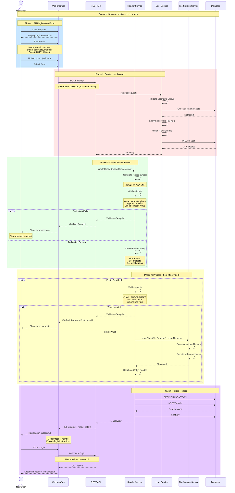

### Level 3: End-to-End Scenarios

**Complete end-to-end scenarios showing system-wide interactions across all architectural views.**

#### 3.1 Complex Lending Scenario with Multiple Concurrent Operations

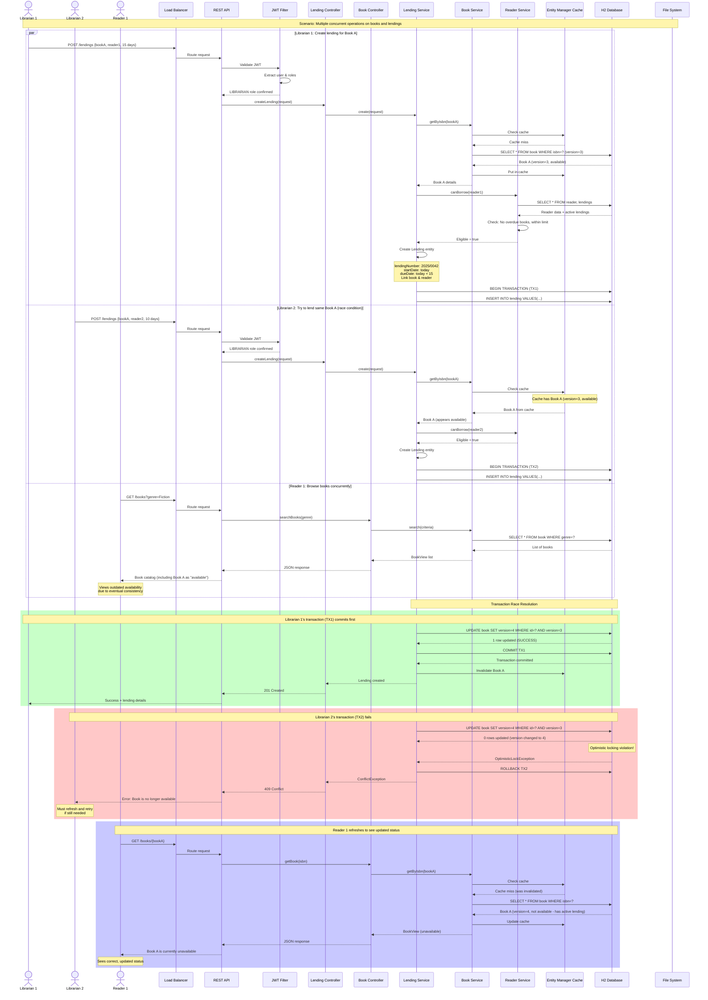

#### 3.2 Complete Multi-Module Scenario: From Book Creation to Return with Fine

```mermaid
sequenceDiagram
    actor Librarian
    actor Reader
    participant API as REST API
    participant AuthSrv as Auth Service
    participant AuthorSrv as Author Service
    participant BookSrv as Book Service
    participant ReaderSrv as Reader Service
    participant LendSrv as Lending Service
    participant PhotoSrv as Photo Service
    participant ExtAPI as API Ninjas
    participant DB as Database
    participant FileStore as File System
    
    Note over Librarian,FileStore: Complete Scenario: Book lifecycle from creation to lending and return
    
    %% Phase 1: Create Author with photo and bio from external API
    rect rgb(230, 240, 255)
        Note over Librarian,ExtAPI: Phase 1: Create Author
        Librarian->>API: POST /authors {name, bio}
        API->>AuthSrv: Validate JWT
        AuthSrv-->>API: Authorized (LIBRARIAN)
        
        API->>AuthorSrv: createAuthor(request)
        AuthorSrv->>AuthorSrv: Generate author number
        
        AuthorSrv->>ExtAPI: GET /quotes (for bio inspiration)
        ExtAPI-->>AuthorSrv: Famous quote
        AuthorSrv->>AuthorSrv: Append quote to bio
        
        AuthorSrv->>DB: INSERT author
        DB-->>AuthorSrv: Author created (id=101)
        AuthorSrv-->>API: AuthorView
        API-->>Librarian: 201 Created {authorNumber: "2025-000042"}
        
        Librarian->>API: POST /authors/2025-000042/photo + [photo file]
        API->>AuthorSrv: uploadPhoto(authorNumber, file)
        AuthorSrv->>PhotoSrv: validateAndStore(file, "author")
        
        PhotoSrv->>PhotoSrv: Validate size/type
        PhotoSrv->>FileStore: Write to ./photos/authors/
        FileStore-->>PhotoSrv: File path
        
        PhotoSrv-->>AuthorSrv: Photo URI
        AuthorSrv->>DB: UPDATE author SET photo=?
        DB-->>AuthorSrv: Updated
        AuthorSrv-->>API: Success
        API-->>Librarian: 200 OK - Photo uploaded
    end
    
    %% Phase 2: Create Book linked to Author
    rect rgb(255, 240, 230)
        Note over Librarian,BookSrv: Phase 2: Create Book
        Librarian->>API: POST /books
        Note over Librarian,API: {isbn, title, genre,<br/>authors: ["2025-000042"]}
        
        API->>BookSrv: createBook(request)
        BookSrv->>AuthorSrv: Verify authors exist
        AuthorSrv->>DB: SELECT authors WHERE number IN (...)
        DB-->>AuthorSrv: Author list (id=101)
        AuthorSrv-->>BookSrv: Authors found
        
        BookSrv->>BookSrv: Create Book entity
        BookSrv->>BookSrv: Link authors
        BookSrv->>DB: INSERT book
        DB-->>BookSrv: Book created
        BookSrv->>DB: INSERT book_authors (book_id, author_id)
        DB-->>BookSrv: Relationship created
        
        BookSrv-->>API: BookView
        API-->>Librarian: 201 Created
        
        Librarian->>API: POST /books/{isbn}/photo + [cover image]
        API->>BookSrv: uploadPhoto(isbn, file)
        BookSrv->>PhotoSrv: validateAndStore(file, "book")
        PhotoSrv->>FileStore: Write to ./photos/books/
        FileStore-->>PhotoSrv: File path
        PhotoSrv-->>BookSrv: Photo URI
        BookSrv->>DB: UPDATE book SET photo=?
        DB-->>BookSrv: Updated
        BookSrv-->>API: Success
        API-->>Librarian: 200 OK
    end
    
    %% Phase 3: Reader searches and views book
    rect rgb(240, 255, 240)
        Note over Reader,BookSrv: Phase 3: Reader Discovers Book
        Reader->>API: GET /books?title=...
        Note over API: No authentication required<br/>for book search
        
        API->>BookSrv: searchBooks(criteria)
        BookSrv->>DB: SELECT books with authors and genres
        DB-->>BookSrv: Book list with relationships
        BookSrv-->>API: BookView list
        API-->>Reader: Books catalog
        
        Reader->>API: GET /books/{isbn}
        API->>BookSrv: getDetails(isbn)
        BookSrv->>DB: SELECT book, authors, genre, active lendings
        DB-->>BookSrv: Full book details
        BookSrv->>BookSrv: Calculate availability
        BookSrv-->>API: Detailed BookView
        API-->>Reader: Book details (available)
        Note over Reader: Decides to borrow
    end
    
    %% Phase 4: Create Lending
    rect rgb(255, 240, 255)
        Note over Librarian,LendSrv: Phase 4: Librarian Creates Lending
        Reader->>Librarian: Request to borrow book
        Note over Reader,Librarian: In-person interaction
        
        Librarian->>API: POST /lendings
        Note over Librarian,API: {isbn, readerNumber, daysUntilReturn: 15}
        
        API->>AuthSrv: Validate JWT
        AuthSrv-->>API: Authorized (LIBRARIAN)
        
        API->>LendSrv: createLending(request)
        
        LendSrv->>BookSrv: getByIsbn(isbn)
        BookSrv->>DB: SELECT book (version=1)
        DB-->>BookSrv: Book
        BookSrv-->>LendSrv: Book available
        
        LendSrv->>ReaderSrv: getByNumber(readerNumber)
        ReaderSrv->>DB: SELECT reader with active lendings
        DB-->>ReaderSrv: Reader details
        ReaderSrv->>ReaderSrv: Check eligibility
        Note over ReaderSrv: No overdue books<br/>Within borrowing limit
        ReaderSrv-->>LendSrv: Reader eligible
        
        LendSrv->>LendSrv: Generate lending number
        Note over LendSrv: 2025/0058
        LendSrv->>LendSrv: Create Lending entity
        Note over LendSrv: startDate: 2025-10-27<br/>dueDate: 2025-11-11<br/>daysUntilReturn: 15
        
        LendSrv->>DB: BEGIN TRANSACTION
        LendSrv->>DB: INSERT lending
        LendSrv->>DB: UPDATE book SET version=2 WHERE version=1
        DB-->>LendSrv: Book updated (optimistic lock success)
        LendSrv->>DB: COMMIT
        
        LendSrv-->>API: LendingView
        API-->>Librarian: 201 Created
        Librarian-->>Reader: Here's your book!
        Note over Reader: Due date: November 11, 2025
    end
    
    %% Phase 5: Time passes, book becomes overdue
    rect rgb(255, 230, 230)
        Note over Reader,LendSrv: Phase 5: Book Becomes Overdue (Time passes)
        Note over Reader: November 11 passes...<br/>Returns on November 16<br/>(5 days late)
        
        Reader->>API: GET /lendings/mine
        Note over Reader: Check personal lendings
        API->>AuthSrv: Validate JWT
        AuthSrv-->>API: Authorized (READER role)
        
        API->>LendSrv: getByReader(username)
        LendSrv->>DB: SELECT lendings WHERE reader.user=?
        DB-->>LendSrv: Lending list
        LendSrv->>LendSrv: Calculate overdue status
        Note over LendSrv: Check: returnedDate is null<br/>AND dueDate < today
        LendSrv-->>API: LendingView (overdue=true, daysDelayed=5)
        API-->>Reader: Your lending is 5 days overdue
        Note over Reader: Realizes must return and pay fine
    end
    
    %% Phase 6: Book Return with Fine Calculation
    rect rgb(240, 230, 255)
        Note over Librarian,LendSrv: Phase 6: Return Book and Calculate Fine
        Reader->>Librarian: Return book (5 days late)
        Librarian->>API: PUT /lendings/2025-0058/return
        Note over Librarian,API: {commentary: "Book in good condition"}
        
        API->>AuthSrv: Validate JWT
        AuthSrv-->>API: Authorized (LIBRARIAN)
        
        API->>LendSrv: returnLending(lendingNumber, commentary)
        LendSrv->>DB: SELECT lending
        DB-->>LendSrv: Lending entity
        
        LendSrv->>LendSrv: Check if already returned
        Note over LendSrv: returnedDate is null → OK
        
        LendSrv->>LendSrv: Calculate days delayed
        Note over LendSrv: returnDate(Nov 16) - dueDate(Nov 11)<br/>= 5 days
        
        LendSrv->>LendSrv: Calculate fine
        Note over LendSrv: Fine = (5 days * 0.5€) + 1€<br/>= 2.5€ + 1€ = 3.5€
        
        LendSrv->>LendSrv: Update Lending entity
        Note over LendSrv: Set returnedDate = Nov 16<br/>Set fine = 3.5€<br/>Set commentary
        
        LendSrv->>DB: BEGIN TRANSACTION
        LendSrv->>DB: UPDATE lending SET returned_date=?, fine=?, commentary=?, version=version+1
        LendSrv->>DB: UPDATE book SET version=3 WHERE version=2
        DB-->>LendSrv: Both updates successful
        LendSrv->>DB: COMMIT
        
        LendSrv-->>API: LendingView with fine
        API-->>Librarian: 200 OK {fine: 3.50, returnDate: "2025-11-16"}
        Librarian-->>Reader: Please pay fine of €3.50
        Note over Reader: Pays fine, transaction complete
    end
    
    %% Phase 7: Reporting and Analytics
    rect rgb(230, 255, 255)
        Note over Librarian,DB: Phase 7: Generate Reports
        Librarian->>API: GET /lendings/average/2025/11
        API->>LendSrv: getAverageLendingDuration(year, month)
        LendSrv->>DB: SELECT AVG(returned_date - start_date)
        Note over DB: WHERE YEAR(start_date)=2025<br/>AND MONTH(start_date)=11<br/>AND returned_date IS NOT NULL
        DB-->>LendSrv: Average: 12.5 days
        LendSrv-->>API: AverageLendingView
        API-->>Librarian: Average lending: 12.5 days
        
        Librarian->>API: GET /lendings?overdue=true
        API->>LendSrv: getOverdueJendings()
        LendSrv->>DB: SELECT lendings
        Note over DB: WHERE returned_date IS NULL<br/>AND due_date < CURRENT_DATE
        DB-->>LendSrv: Overdue lending list
        LendSrv-->>API: LendingView list
        API-->>Librarian: List of overdue lendings
        Note over Librarian: Takes action on overdue items
    end
```

---

## Summary

This document provides a comprehensive 4+1 architectural view model for the Library Management System with three levels of depth for each view:

### View Coverage

1. **Logical View** - Shows the system's conceptual structure, domain model, and key abstractions
   - Level 1: System context with main modules
   - Level 2: Detailed module structure with components
   - Level 3: Complete class diagram with relationships

2. **Process View** - Describes runtime behavior, concurrency, and communication
   - Level 1: High-level process overview
   - Level 2: Component interactions with sequence flows
   - Level 3: Detailed concurrent scenarios with transactions

3. **Development View** - Shows the code organization and module dependencies
   - Level 1: Layered architecture
   - Level 2: Package organization by business capability
   - Level 3: Detailed module dependencies

4. **Physical View** - Describes deployment and infrastructure
   - Level 1: Simple deployment topology
   - Level 2: Infrastructure components with configurations
   - Level 3: Complete deployment with all details

5. **Scenarios (Use Cases)** - The "+1" that ties everything together
   - Level 1: Key use case overview
   - Level 2: Detailed use case flows
   - Level 3: Complex end-to-end scenarios

### Key Architectural Patterns Identified

- **Layered Architecture** with clear separation of concerns
- **Domain-Driven Design** influences with rich domain model
- **Repository Pattern** for data access abstraction
- **RESTful API** design
- **JWT-based Security** with role-based access control
- **Optimistic Locking** for concurrency control
- **Value Objects** for type safety
- **Service Layer** for business logic encapsulation

### Technology Highlights

- Spring Boot 3.2.5 ecosystem
- JPA/Hibernate for ORM
- H2 Database (development)
- MapStruct for DTO mapping
- BCrypt for password encryption
- RSA JWT tokens

---

**Document Version:** 1.0  
**Date:** October 27, 2025  
**Architecture Model:** 4+1 View (Kruchten)  
**System:** Library Management System (PSOFT-G1)
