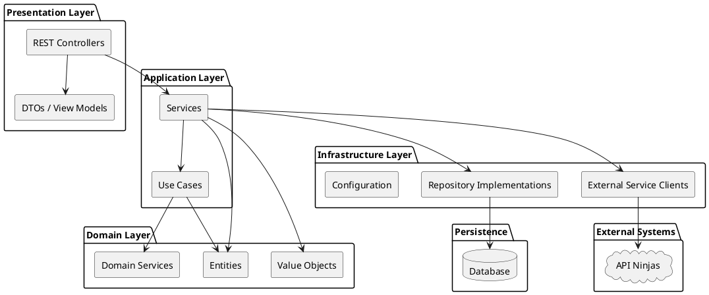
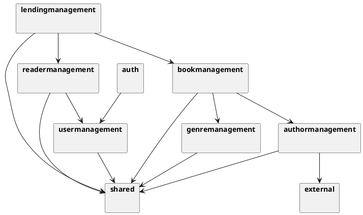
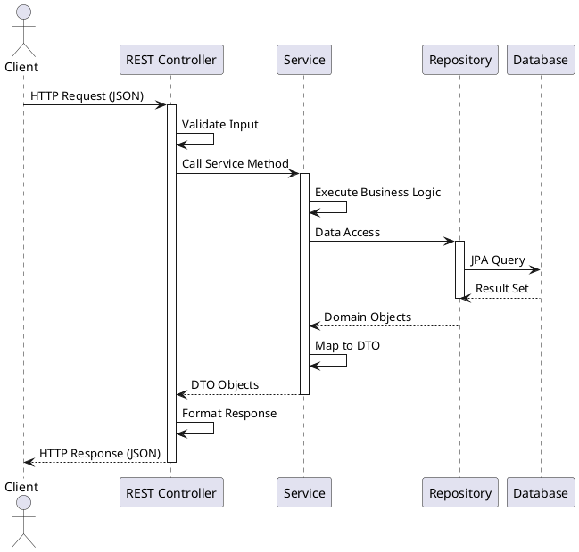

# Component View - Library Management System

## 1. Component Overview

This document describes the system's components, their responsibilities, and interactions.

## 2. Component Diagram

### 2.1 High-Level Components

```plantuml
@startuml
!include https://raw.githubusercontent.com/plantuml-stdlib/C4-PlantUML/master/C4_Component.puml

LAYOUT_WITH_LEGEND()

title Component Diagram - Library Management System

Container_Boundary(api, "Library Management System") {
    Component(auth, "Authentication", "Spring Security", "Handles user authentication and authorization")
    Component(userMgmt, "User Management", "Spring Boot Service", "Manages user accounts and roles")
    Component(readerMgmt, "Reader Management", "Spring Boot Service", "Manages reader profiles and operations")
    Component(authorMgmt, "Author Management", "Spring Boot Service", "Manages author information")
    Component(bookMgmt, "Book Management", "Spring Boot Service", "Manages book catalog")
    Component(genreMgmt, "Genre Management", "Spring Boot Service", "Manages genre classification")
    Component(lendingMgmt, "Lending Management", "Spring Boot Service", "Manages lending operations and fines")
    Component(shared, "Shared Components", "Spring Boot", "Common utilities and value objects")
    
    ComponentDb(database, "Database", "H2/JPA", "Stores all application data")
    Component(external, "External Services", "WebClient", "Integration with external APIs")
}

Person(librarian, "Librarian", "Library staff")
Person(reader, "Reader", "Library member")
Person(admin, "Administrator", "System administrator")

System_Ext(apiNinjas, "API Ninjas", "External historical events service")

Rel(librarian, auth, "Authenticates", "HTTPS/JWT")
Rel(reader, auth, "Authenticates", "HTTPS/JWT")
Rel(admin, auth, "Authenticates", "HTTPS/JWT")

Rel(librarian, authorMgmt, "Manages authors", "REST API")
Rel(librarian, bookMgmt, "Manages books", "REST API")
Rel(librarian, lendingMgmt, "Manages lendings", "REST API")
Rel(librarian, readerMgmt, "Views readers", "REST API")

Rel(reader, readerMgmt, "Manages profile", "REST API")
Rel(reader, bookMgmt, "Searches books", "REST API")
Rel(reader, lendingMgmt, "Views lendings", "REST API")

Rel(admin, userMgmt, "Manages users", "REST API")

Rel(auth, userMgmt, "Validates credentials", "")
Rel(userMgmt, readerMgmt, "Reader is user", "")
Rel(readerMgmt, lendingMgmt, "Creates lendings", "")
Rel(bookMgmt, genreMgmt, "Categorizes by genre", "")
Rel(bookMgmt, authorMgmt, "Associated with authors", "")
Rel(lendingMgmt, bookMgmt, "Borrows books", "")
Rel(lendingMgmt, readerMgmt, "Lends to readers", "")

Rel(userMgmt, database, "Reads/Writes", "JPA")
Rel(readerMgmt, database, "Reads/Writes", "JPA")
Rel(authorMgmt, database, "Reads/Writes", "JPA")
Rel(bookMgmt, database, "Reads/Writes", "JPA")
Rel(genreMgmt, database, "Reads/Writes", "JPA")
Rel(lendingMgmt, database, "Reads/Writes", "JPA")

Rel(external, apiNinjas, "Fetches data", "HTTPS")
Rel(authorMgmt, external, "Uses", "")

Rel(userMgmt, shared, "Uses", "")
Rel(readerMgmt, shared, "Uses", "")
Rel(authorMgmt, shared, "Uses", "")
Rel(bookMgmt, shared, "Uses", "")
Rel(lendingMgmt, shared, "Uses", "")

@enduml
```

## 3. Component Details

### 3.1 Authentication Component
**Responsibility**: Handle user authentication and authorization

**Key Classes**:
- `SecurityConfig`: Spring Security configuration
- `JwtAuthenticationConverter`: JWT token processing

**Interfaces**:
- REST endpoints: `/auth/**`

**Dependencies**:
- User Management (for credential validation)
- Spring Security OAuth2 Resource Server

### 3.2 User Management Component
**Responsibility**: Manage user accounts and roles

**Package**: `pt.psoft.g1.psoftg1.usermanagement`

**Key Classes**:
- `User`: Domain entity
- `Role`: User role enumeration
- `UserRepository`: Data access interface
- `UserService`: Business logic
- `UserAdminApi`: REST controller

**Interfaces**:
- REST endpoints: `/api/admin/user/**`

**Dependencies**:
- Database via JPA
- Shared components

### 3.3 Reader Management Component
**Responsibility**: Manage reader profiles and operations

**Package**: `pt.psoft.g1.psoftg1.readermanagement`

**Key Classes**:
- `Reader`: Domain entity extending User
- `ReaderDetails`: Reader profile information
- `ReaderRepository`: Data access interface
- `ReaderService`: Business logic
- `ReaderController`: REST controller

**Interfaces**:
- REST endpoints: `/api/readers/**`

**Dependencies**:
- User Management
- Database via JPA
- Shared components

### 3.4 Author Management Component
**Responsibility**: Manage author information and biographies

**Package**: `pt.psoft.g1.psoftg1.authormanagement`

**Key Classes**:
- `Author`: Domain entity
- `AuthorBio`: Value object for biography
- `AuthorRepository`: Data access interface
- `AuthorService`: Business logic
- `AuthorController`: REST controller

**Interfaces**:
- REST endpoints: `/api/authors/**`

**Dependencies**:
- Database via JPA
- External Services (for enrichment)
- Shared components

### 3.5 Book Management Component
**Responsibility**: Manage book catalog and inventory

**Package**: `pt.psoft.g1.psoftg1.bookmanagement`

**Key Classes**:
- `Book`: Domain entity
- `Isbn`: Value object
- `Title`: Value object
- `BookRepository`: Data access interface
- `BookService`: Business logic
- `BookController`: REST controller

**Interfaces**:
- REST endpoints: `/api/books/**`

**Dependencies**:
- Genre Management
- Author Management
- Database via JPA
- Shared components

### 3.6 Genre Management Component
**Responsibility**: Manage book genre classification

**Package**: `pt.psoft.g1.psoftg1.genremanagement`

**Key Classes**:
- `Genre`: Domain entity
- `GenreRepository`: Data access interface
- `GenreService`: Business logic
- `GenreController`: REST controller

**Interfaces**:
- REST endpoints: `/api/genre/**`

**Dependencies**:
- Database via JPA
- Shared components

### 3.7 Lending Management Component
**Responsibility**: Manage book lending operations and fines

**Package**: `pt.psoft.g1.psoftg1.lendingmanagement`

**Key Classes**:
- `Lending`: Domain entity
- `Fine`: Domain entity
- `LendingNumber`: Value object
- `LendingRepository`: Data access interface
- `LendingService`: Business logic
- `LendingController`: REST controller

**Interfaces**:
- REST endpoints: `/api/lendings/**`

**Dependencies**:
- Book Management
- Reader Management
- Database via JPA
- Shared components

### 3.8 Shared Components
**Responsibility**: Provide common functionality and value objects

**Package**: `pt.psoft.g1.psoftg1.shared`

**Key Classes**:
- Value Objects: `Name`, `EmailAddress`, `PhoneNumber`, `Password`, `Description`
- Common utilities
- Base repository interfaces
- Common API models

**Interfaces**:
- Internal APIs (no REST endpoints)

**Dependencies**:
- None (foundation layer)

### 3.9 External Services Component
**Responsibility**: Integration with external APIs

**Package**: `pt.psoft.g1.psoftg1.external`

**Key Classes**:
- `ApiNinjasService`: External API client
- `HistoricalEventsResponse`: Response model
- `ApiNinjasConfig`: Configuration

**Interfaces**:
- Internal service interface

**Dependencies**:
- Spring WebFlux WebClient
- External API Ninjas service

## 4. Layered Architecture View



## 5. Module Dependencies



## 6. Data Flow

### 6.1 Typical Request Flow
1. **Client Request**: Client sends HTTP request to REST API
2. **Authentication**: Spring Security validates JWT token
3. **Controller**: REST controller receives request and validates input
4. **Service**: Service layer executes business logic
5. **Repository**: Repository accesses database through JPA
6. **Response Mapping**: Service maps domain objects to DTOs
7. **HTTP Response**: Controller returns JSON response

### 6.2 Data Flow Diagram



## 7. Component Communication Patterns

### 7.1 Synchronous Communication
- REST API calls between client and server
- Service-to-service method calls within the application
- Database queries through JPA

### 7.2 Repository Pattern
- Interface-based data access
- Implementation through Spring Data JPA
- Abstraction of persistence details

### 7.3 DTO Pattern
- Data transfer between layers
- Separation of concerns
- API version control

## 8. Component Deployment

All components are deployed as a single monolithic Spring Boot application:
- Single JAR file deployment
- Embedded Tomcat server
- Shared JVM and memory space
- Single database connection pool

## 9. Technology Mapping

| Component | Technology |
|-----------|------------|
| REST API | Spring MVC, Spring Web |
| Services | Spring Core, Spring Boot |
| Repositories | Spring Data JPA, Hibernate |
| Security | Spring Security, OAuth2 Resource Server |
| Database | H2 (development), JPA/Hibernate |
| API Documentation | SpringDoc OpenAPI |
| Object Mapping | MapStruct |
| External Services | Spring WebFlux WebClient |
| Configuration | Spring Boot Configuration |

## References
- [Architecture Overview](./01-Architecture-Overview.md)
- [Architecturally Significant Requirements](./04-ASR.md)
- [Architectural Patterns](./09-Architectural-Patterns.md)
