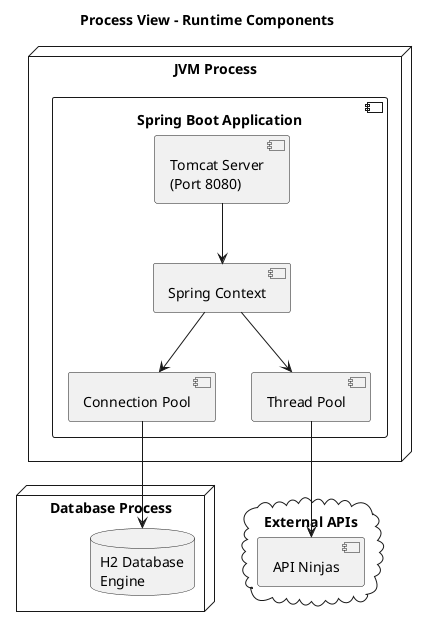

# Deployment View - Library Management System

## 1. Deployment Overview

This document describes how the Library Management System is deployed and executed in different environments.

## 2. Deployment Architecture

### 2.1 Deployment Diagram

```plantuml
@startuml
!include https://raw.githubusercontent.com/plantuml-stdlib/C4-PlantUML/master/C4_Deployment.puml

LAYOUT_WITH_LEGEND()

title Deployment Diagram - Library Management System

Deployment_Node(client, "Client Device", "Browser/REST Client") {
    Container(browser, "Web Browser", "Chrome, Firefox, Safari", "Provides UI for API interaction")
    Container(restClient, "REST Client", "Postman, cURL", "API testing and integration")
}

Deployment_Node(server, "Application Server", "JVM") {
    Deployment_Node(tomcat, "Embedded Tomcat", "Spring Boot") {
        Container(app, "Spring Boot Application", "Java 17", "Library Management System")
    }
}

Deployment_Node(database, "Database Server", "H2 Engine") {
    ContainerDb(h2, "H2 Database", "In-Memory/File", "Stores application data")
}

Deployment_Node(external, "External Services", "Internet") {
    System_Ext(apiNinjas, "API Ninjas", "Historical events API")
}

Rel(browser, app, "Uses", "HTTPS/REST")
Rel(restClient, app, "Uses", "HTTPS/REST")
Rel(app, h2, "Reads/Writes", "JDBC")
Rel(app, apiNinjas, "Fetches data", "HTTPS")

@enduml
```

## 3. Deployment Environments

### 3.1 Development Environment

**Purpose**: Local development and testing

**Configuration**:
- Single developer machine
- Embedded H2 database (in-memory)
- Spring Boot with DevTools
- Maven for build and dependency management

**Deployment**:
```bash
mvn spring-boot:run
```

**Access**:
- Application: `http://localhost:8080`
- Swagger UI: `http://localhost:8080/swagger-ui.html`
- H2 Console: `http://localhost:8080/h2-console`

**Characteristics**:
- Fast startup
- Auto-reload on code changes
- In-memory database (data lost on restart)
- Detailed logging enabled
- No security constraints on H2 console

### 3.2 Testing Environment

**Purpose**: Integration testing and quality assurance

**Configuration**:
- Shared test server
- H2 database (file-based for persistence)
- Spring Boot packaged as JAR
- Test data initialization

**Deployment**:
```bash
mvn clean package
java -jar target/psoft-g1-0.0.1-SNAPSHOT.jar --spring.profiles.active=test
```

**Characteristics**:
- Persistent database between restarts
- Test data seeding
- Integration test execution
- API testing through Postman/Newman

### 3.3 Production Environment (Target)

**Purpose**: Live system deployment

**Configuration**:
- Production server (cloud or on-premises)
- Production database (PostgreSQL/MySQL)
- Spring Boot packaged as JAR
- External configuration
- Monitoring and logging

**Deployment**:
```bash
java -jar psoft-g1.jar \
  --spring.profiles.active=prod \
  --spring.datasource.url=jdbc:postgresql://db-server:5432/library \
  --server.port=8080
```

**Characteristics**:
- High availability configuration
- Production database
- Secure configuration
- External logging and monitoring
- SSL/TLS encryption

## 4. Runtime Architecture

### 4.1 Process View



### 4.2 Thread Model

**Request Processing**:
- Tomcat thread pool handles incoming HTTP requests
- Default: 200 max threads
- Each request processed by a dedicated thread
- Thread returned to pool after response sent

**Database Connections**:
- HikariCP connection pool
- Default: 10 connections
- Connection reuse across requests
- Automatic connection management

**Async Processing**:
- WebClient for non-blocking external API calls
- Reactor thread pool for reactive operations

## 5. Deployment Artifacts

### 5.1 Application Package

**Artifact**: `psoft-g1-0.0.1-SNAPSHOT.jar`

**Type**: Executable JAR (Fat JAR)

**Contents**:
- Compiled application classes
- All dependencies
- Embedded Tomcat server
- Static resources
- Application properties

**Build Command**:
```bash
mvn clean package
```

**Size**: ~80 MB (approximate)

### 5.2 Configuration Files

**application.properties** (or application.yml):
- Database connection settings
- Server port configuration
- Security settings
- Logging configuration
- External API credentials

**Profile-specific configurations**:
- `application-dev.properties`: Development settings
- `application-test.properties`: Test settings
- `application-prod.properties`: Production settings

## 6. Deployment Procedures

### 6.1 Manual Deployment

**Steps**:
1. Build the application
   ```bash
   mvn clean package -DskipTests
   ```

2. Copy JAR to target server
   ```bash
   scp target/psoft-g1-0.0.1-SNAPSHOT.jar user@server:/opt/library-app/
   ```

3. Start the application
   ```bash
   java -jar psoft-g1-0.0.1-SNAPSHOT.jar
   ```

4. Verify deployment
   ```bash
   curl http://server:8080/actuator/health
   ```

### 6.2 Containerized Deployment (Docker)

**Dockerfile** (example):
```dockerfile
FROM eclipse-temurin:17-jre
WORKDIR /app
COPY target/psoft-g1-0.0.1-SNAPSHOT.jar app.jar
EXPOSE 8080
ENTRYPOINT ["java", "-jar", "app.jar"]
```

**Build and Run**:
```bash
docker build -t library-management-system .
docker run -p 8080:8080 library-management-system
```

### 6.3 CI/CD Pipeline (Recommended)

**Pipeline Stages**:
1. **Source**: Git commit triggers build
2. **Build**: Maven compiles and packages
3. **Test**: Unit and integration tests
4. **Security Scan**: Dependency vulnerabilities
5. **Package**: Create Docker image
6. **Deploy**: Push to target environment
7. **Smoke Test**: Verify deployment

## 7. Infrastructure Requirements

### 7.1 Hardware Requirements

**Minimum**:
- CPU: 2 cores
- RAM: 2 GB
- Disk: 5 GB
- Network: 100 Mbps

**Recommended**:
- CPU: 4 cores
- RAM: 4 GB
- Disk: 20 GB (for logs and database)
- Network: 1 Gbps

### 7.2 Software Requirements

**Required**:
- Java Runtime Environment (JRE) 17 or higher
- Operating System: Linux, Windows, or macOS
- Network connectivity for external APIs

**Optional**:
- Reverse proxy (Nginx, Apache)
- Load balancer (for high availability)
- Container runtime (Docker)
- Orchestration platform (Kubernetes)

## 8. Network Configuration

### 8.1 Port Configuration

| Port | Protocol | Purpose |
|------|----------|---------|
| 8080 | HTTP | Application server |
| 8443 | HTTPS | Secure application server (optional) |
| 5432 | TCP | PostgreSQL database (production) |
| 3306 | TCP | MySQL database (alternative) |

### 8.2 Firewall Rules

**Inbound**:
- Allow port 8080 from client network
- Allow port 8443 from internet (if HTTPS)
- Allow database port from application server only

**Outbound**:
- Allow HTTPS (443) for external API calls
- Allow database port to database server
- Allow NTP for time synchronization

## 9. Security Considerations

### 9.1 Transport Security
- HTTPS/TLS for all external communications
- Certificate management
- TLS 1.2+ only

### 9.2 Application Security
- JWT tokens for authentication
- Password encryption (BCrypt)
- Input validation and sanitization
- CORS configuration
- Security headers

### 9.3 Network Security
- Firewall configuration
- VPN for internal communications
- DMZ for public-facing services
- Network segmentation

## 10. Monitoring and Observability

### 10.1 Health Checks

Spring Boot Actuator endpoints:
- `/actuator/health`: Application health status
- `/actuator/info`: Application information
- `/actuator/metrics`: Performance metrics

### 10.2 Logging

**Log Locations**:
- Console output (development)
- File: `/var/log/library-app/application.log` (production)
- Centralized logging system (ELK stack, Splunk)

**Log Levels**:
- ERROR: Application errors
- WARN: Warning conditions
- INFO: General information
- DEBUG: Detailed debug information (development only)

### 10.3 Monitoring Metrics

**Application Metrics**:
- Request rate and latency
- Error rates
- Active sessions
- Database connection pool usage

**System Metrics**:
- CPU usage
- Memory usage
- Disk I/O
- Network traffic

## 11. Backup and Recovery

### 11.1 Database Backup

**Strategy**:
- Daily full backups
- Transaction log backups (if applicable)
- Retention: 30 days

**Backup Command** (H2 file-based):
```bash
cp /data/library.mv.db /backup/library-$(date +%Y%m%d).mv.db
```

### 11.2 Application Recovery

**Recovery Procedures**:
1. Stop the application
2. Restore database from backup
3. Start the application
4. Verify system health
5. Validate data integrity

### 11.3 Disaster Recovery

**RPO (Recovery Point Objective)**: 24 hours
**RTO (Recovery Time Objective)**: 4 hours

## 12. Scalability Considerations

### 12.1 Horizontal Scaling

**Load Balancer Configuration**:
```
Client → Load Balancer → [App Instance 1]
                      → [App Instance 2]
                      → [App Instance 3]
                          ↓
                    [Database Server]
```

**Requirements**:
- Stateless application design (JWT tokens)
- Shared database
- Session replication (if needed)
- Sticky sessions (optional)

### 12.2 Vertical Scaling

**Options**:
- Increase JVM heap size: `-Xmx4g -Xms2g`
- Increase thread pool size
- Increase database connection pool
- More CPU cores and RAM

## 13. Deployment Best Practices

### 13.1 Pre-Deployment Checklist
- ✅ All tests pass
- ✅ Security scan completed
- ✅ Database migrations ready
- ✅ Configuration verified
- ✅ Backup completed
- ✅ Rollback plan prepared

### 13.2 Post-Deployment Verification
- ✅ Health check passes
- ✅ API endpoints accessible
- ✅ Authentication works
- ✅ Database connectivity verified
- ✅ Logs reviewed for errors
- ✅ Performance metrics normal

### 13.3 Rollback Procedure
1. Stop current application
2. Restore previous JAR version
3. Rollback database if needed
4. Start previous version
5. Verify system functionality

## References
- [Architecture Overview](./01-Architecture-Overview.md)
- [Component View](./02-Component-View.md)
- [Quality Attributes](./05-Quality-Attributes.md)
